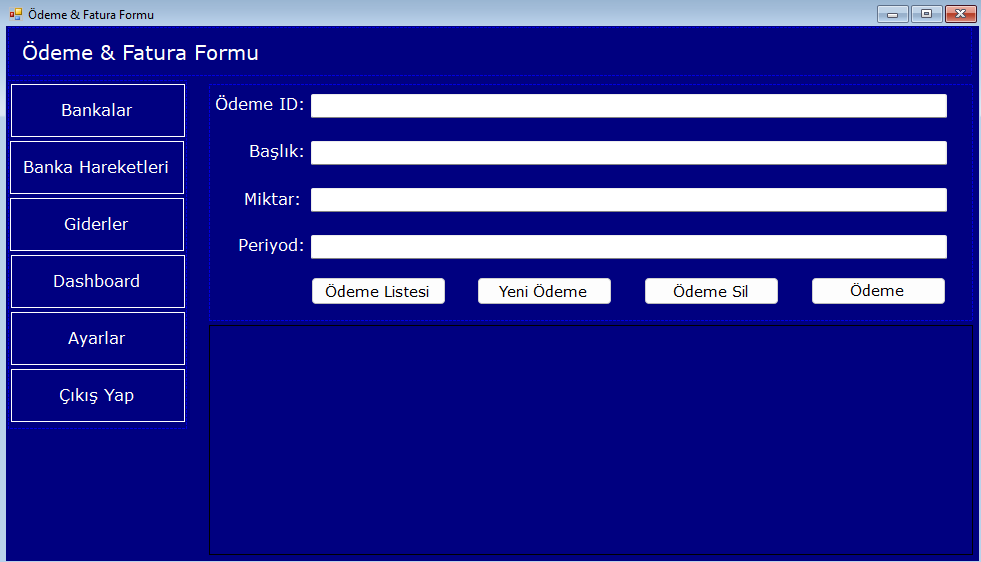
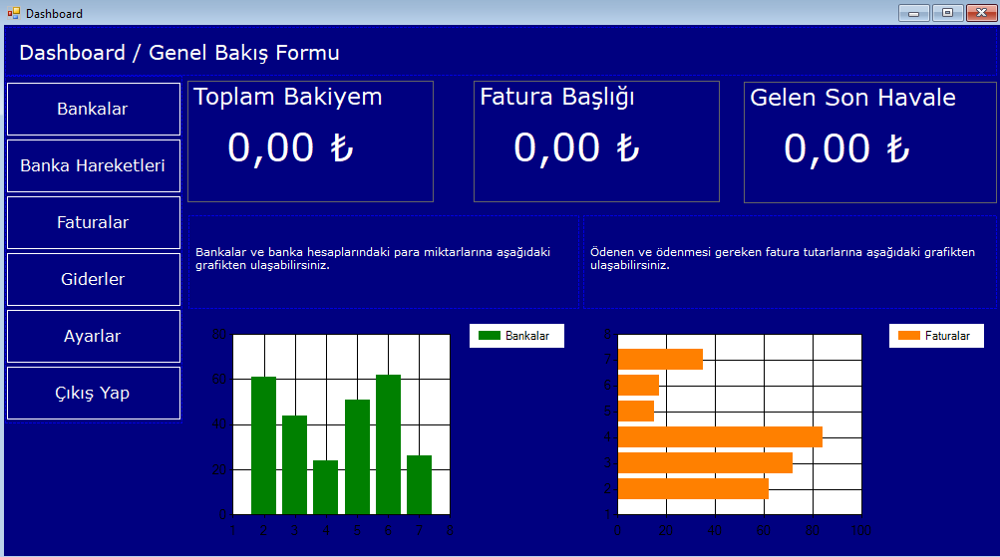

# 💼 Finansal CRM Masaüstü Uygulaması

🧾 Proje Türü: Windows Forms - Finans Takip & CRM  
💾 Veritabanı: Microsoft SQL Server  
🔐 Giriş Sistemi: Kullanıcı Doğrulama

---

## 📌 Proje Özeti

**Finansal CRM**, bireysel veya kurumsal kullanıcıların finansal hareketlerini takip etmelerine yardımcı olan, C# ile geliştirilen bir masaüstü uygulamasıdır. ERP benzeri özellikler sunarak fatura, banka ve harcama yönetimini sade ve anlaşılır bir arayüzle kolaylaştırır.

---

## 🛠️ Kullanılan Teknolojiler

- 🎯 **C# (.NET Framework / Windows Forms)**
- 🗃️ **Entity Framework (Database First)**
- 🧠 **Microsoft SQL Server**
- 🎨 **Custom UI & Modüler Form Yapısı**
- 🔐 **Login Sistemi & Session Yönetimi**

---

## 📸 Ekran Görüntüleri

  

---

## ✨ Temel Özellikler

### 💸 Gider Modülü
- Harcama ekleme, silme ve güncelleme
- En yüksek ve son harcama gösterimi
- Aylık toplam harcama hesabı
- Kategori seçimi ile sınıflandırma

### 🏦 Banka & İşlem Modülü
- Banka kaydı ve listeleme
- Banka hareketlerini görüntüleme
- Gelişmiş filtreleme seçenekleri

### 📑 Fatura Takip
- Ödeme periyodu ve tutarları yönetme
- Listeleme ve güncelleme paneli

### 📊 Dashboard (Kontrol Paneli)
- Özet veri kutuları (Card UI)
- En güncel finansal bilgilere hızlı erişim
- Formlar arası geçişler

---

## 🧠 Yapı

- `Models/` → EF veri modelleri
- `Services/` → Login kontrol sınıfları
- `Manager/` → Global kullanıcı yönetimi
- `Forms/` → Tüm UI formları ve işlevler
- `Assets/` → Ekran görüntüleri

---

## 🙏 Teşekkürler
---

## 📬 İletişim

📧 **ahmet_mert_cetinkaya@outlook.com.tr**  
🔗 [LinkedIn](https://linkedin.com/in/ahmetmertcetinkaya)  
🐙 [GitHub](https://github.com/ahmet-mert-cetinkaya)

---
